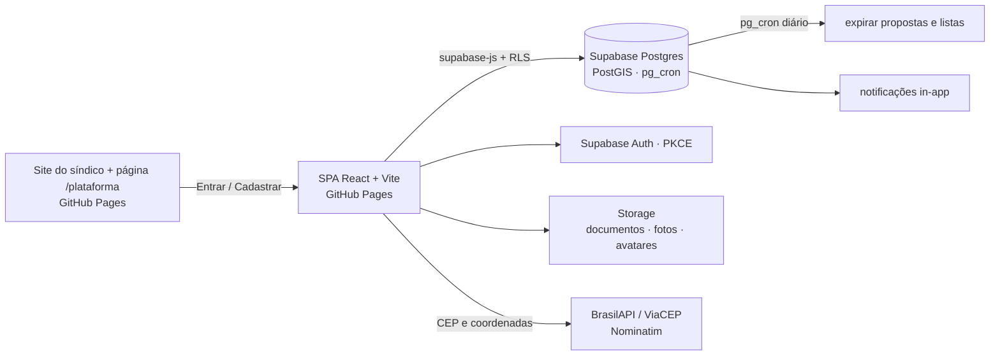
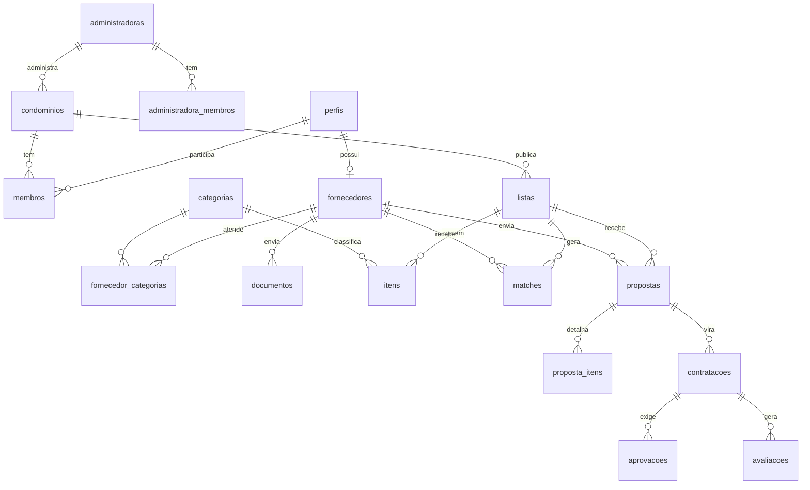

# Arquitetura — FacilAdmin Plataforma

> Atualizado em set/2026 com o que foi construído no MVP. Onde a construção mudou o desenho original, a seção 9 explica.

## 1. Contexto
Marketplace de facilities para condomínios.

- **Demanda:** condomínios (síndico, conselho, administradora) e condôminos publicam listas de necessidades.
- **Oferta:** prestadores de serviço e vendedores de produtos recebem oportunidades compatíveis, enviam propostas estruturadas por item e são avaliados.

A plataforma conecta, compara e registra. Não intermedeia pagamento no MVP.

## 2. Visão geral (C4 — contêineres)



## 3. Stack (ecossistema learnTECH)
| Camada | Tecnologia |
|---|---|
| Front | React 18, TypeScript (strict), Vite, Tailwind, shadcn/ui, TanStack Query, React Router, React Hook Form + Zod |
| Back | Supabase: Postgres + RLS + PostGIS, Auth, Storage, pg_cron |
| Endereço | BrasilAPI v2 / ViaCEP (CEP → endereço) e Nominatim/OSM (endereço → coordenadas), chamados do navegador |
| Avisos | Notificações in-app (tabela `notificacoes`). E-mail pelo Resend fica para a fase 2 |
| Qualidade | Vitest + Testing Library (front), cenário SQL/Python de regras (banco), CI no GitHub Actions |
| Hospedagem | GitHub Pages (SPA com fallback `404.html`), Supabase free |

## 4. Estrutura do repositório
```
facil-admin-plataforma/
├── src/
│   ├── app/                 App (rotas + provedores), Layout, RotaProtegida, menu, marca, páginas estáticas
│   ├── features/
│   │   ├── auth/            AuthContext, contexto (useAuth), Entrar, Cadastro, NovaSenha, Conta
│   │   ├── organizacoes/    Condominios, CondominioDetalhe (membros, convite, regras), api
│   │   ├── fornecedores/    PerfilFornecedor (dados, raio, categorias, documentos), api
│   │   ├── necessidades/    Listas, NovaLista, ListaDetalhe, validacao, api
│   │   ├── matching/        Oportunidades, OportunidadeDetalhe (proposta), api
│   │   ├── propostas/       Comparativo, MinhasPropostas, regras, api
│   │   ├── contratacoes/    Contratacoes, ContratacaoDetalhe (conselho, contatos, avaliação), api
│   │   ├── painel/          Painel
│   │   ├── notificacoes/    Notificacoes
│   │   └── admin/           Admin (documentos, fornecedores, categorias)
│   ├── components/          Comuns (cabeçalho, vazio, erro, selos, score), CamposEndereco, ui/ (shadcn)
│   ├── lib/                 supabase (cliente + rpc), tipos, formatos, endereco, utils
│   └── test/                testes Vitest
├── supabase/
│   ├── migrations/          01 esquema · 02 RLS · 03 funções · 04 categorias · 05 storage e agenda
│   └── tests/               ambiente.sql, cenario.py, rodar.sh
├── docs/
└── .github/workflows/       ci.yml, deploy.yml, banco.yml, manter-ativo.yml
```
Organização por *feature*: cada domínio reúne telas, chamadas ao banco (`api.ts`) e regras puras testáveis.

## 5. Modelo de dados



| Tabela | Campos principais |
|---|---|
| `perfis` | user_id, nome, telefone, tipo (gestor · condomino · fornecedor), is_admin |
| `administradoras` / `administradora_membros` | nome, cnpj / quem faz parte da equipe |
| `condominios` | nome, cep, endereço, bairro, cidade, uf, `geo`, unidades, administradora_id, min_propostas (3), limite_conselho (5000), codigo_convite |
| `membros` | condominio_id, user_id, papel (sindico · conselheiro · condomino), unidade, status (pendente · ativo · recusado) |
| `categorias` | slug, nome, grupo (servico · produto), certificacoes[], ativo |
| `fornecedores` | user_id, razão social, documento, tipo, cidade/uf, `geo`, raio_km, verificado, ativo |
| `documentos` | tipo (cnpj · nr10 · nr35 · credenciamento_bombeiros · seguro · outro), arquivo_path, validade, status |
| `listas` | condominio_id, criado_por, escopo (condominio · unidade), unidade, título, status (sugestao · rascunho · aberta · em_aprovacao · contratada · encerrada · cancelada), prazo_propostas, data_desejada, fotos[] |
| `itens` | lista_id, categoria_id, descrição, quantidade, unidade_medida, recorrência |
| `matches` | lista_id, fornecedor_id, score, motivos[], cobertura, distancia_km, status (sugerido · visto · proposta · ignorado) |
| `propostas` / `proposta_itens` | valor_total (calculado no banco), prazo_execucao_dias, validade, condições / valor unitário por item |
| `contratacoes` | lista_id, proposta_id, status (aguardando_aprovacao · aprovada · recusada · em_execucao · concluida · cancelada), exige_conselho |
| `aprovacoes` | contratacao_id, conselheiro, aprova, comentário |
| `avaliacoes` | contratacao_id, avaliador, papel (contratante · fornecedor), nota 1–5 |
| `notificacoes` | user_id, tipo, título, link, lida |
| `config_match` | pesos do score e quantos fornecedores avisar |

O papel **administradora** não fica em `membros`: é derivado de `administradora_membros` + `condominios.administradora_id`.

## 6. Regras de negócio
| Regra | Onde fica |
|---|---|
| **RN01** Condômino entra pelo código de convite e o síndico aprova | `entrar_condominio`, `gerenciar_membro` |
| **RN02** Oportunidade só para fornecedor verificado e ativo, dentro do raio (ou na mesma cidade sem coordenadas) | `calcular_matches` |
| **RN03** Categoria com certificação exige o documento aprovado e válido | `atende_item` |
| **RN04** Fornecedor vê só bairro e cidade; endereço e contatos só depois da aprovação | `oportunidades`, `oportunidade_detalhe`, `contatos_contratacao` |
| **RN05** Comparativo abre com o mínimo de propostas (padrão 3) ou no fim do prazo | `comparativo_liberado`, `comparativo` |
| **RN06** Acima do limite (padrão R$ 5.000), na lista do condomínio com conselheiros ativos, a escolha vai ao conselho; aprova com maioria simples; empate recusa | `escolher_proposta`, `votar_contratacao` |
| **RN07** Condômino sugere para o condomínio (o síndico publica) e faz lista da própria unidade (decide sozinho, sem conselho) | `salvar_lista`, `publicar_lista` |
| **RN08** Avaliação mútua, uma por lado, depois da conclusão | `avaliar`, `reputacao_fornecedor` |

### Score do match (0–100)
| Fator | Peso | Cálculo |
|---|---|---|
| Cobertura | 25 | itens atendidos ÷ itens da lista |
| Reputação | 25 | média bayesiana (prior 4,0 com peso 3) |
| Distância | 15 | 1 − distância ÷ raio |
| Resposta | 15 | propostas ÷ oportunidades (90 dias); neutro com menos de 3 |
| Aceite | 10 | propostas escolhidas ÷ decididas (180 dias); neutro com menos de 3 |
| Histórico | 5 | já concluiu serviço para este condomínio |
| Atividade | 5 | última atividade em 30 dias (1) / 90 dias (0,5) |

Os pesos ficam em `config_match` e podem ser ajustados sem deploy. Cada match grava os **motivos** em texto (ex.: "A 0,7 km do condomínio", "Certificações validadas: NR-10").

## 7. Segurança e privacidade
| Recurso | Quem lê | Quem escreve |
|---|---|---|
| Condomínio | Membros ativos | Gestor (colunas liberadas: dados e regras) |
| Membros | O próprio e gestores (demais via `membros_condominio`, sem unidade) | Gestor, por função |
| Lista do condomínio | Membros depois de publicada; gestores e autor em rascunho/sugestão | Por função |
| Lista da unidade | Só o condômino autor | O autor |
| Oportunidade (bairro, cidade, itens) | Fornecedor com match (função) | — |
| Propostas | Autor; quem decide depois do comparativo liberado | Fornecedor, por função |
| Endereço e contatos | Partes da contratação aprovada (função) | — |
| Documentos do fornecedor | O fornecedor e o admin | Fornecedor envia; admin revisa |
| Avaliações | As partes (média pública pela função) | Partes da contratação concluída |

- RLS em todas as tabelas. Escrita de regra de negócio só por funções `SECURITY DEFINER`, que exigem login.
- Funções internas (`notificar`, `calcular_matches`, `gravar_matches`, `concluir_escolha`, `expirar`) ficam fora da API.
- Um gatilho impede usuário comum de alterar `is_admin` ou `verificado`.
- Buckets:
  - `documentos` (privado, pasta `<fornecedor_id>/`);
  - `fotos-necessidades` (privado, pasta `<condominio_id>/<lista_id>/`);
  - `avatares` (público, pasta `<user_id>/`).

## 8. Funções no banco (API)
| Grupo | Funções |
|---|---|
| Organizações | `criar_administradora`, `criar_condominio`, `meus_condominios`, `entrar_condominio`, `gerenciar_membro`, `novo_codigo_convite`, `membros_condominio` |
| Fornecedor | `salvar_fornecedor`, `registrar_documento`, `revisar_documento` (admin), `verificar_fornecedor` (admin), `reputacao_fornecedor` |
| Listas | `salvar_lista`, `publicar_lista`, `cancelar_lista`, `minhas_listas` |
| Fornecedor × oportunidade | `oportunidades`, `oportunidade_detalhe`, `ignorar_oportunidade`, `enviar_proposta`, `retirar_proposta`, `minhas_propostas` |
| Decisão | `comparativo`, `escolher_proposta`, `votar_contratacao`, `atualizar_contratacao`, `minhas_contratacoes`, `contatos_contratacao`, `avaliar` |
| Painel e rotina | `painel`, `expirar` (pg_cron diário 06:15 UTC) |

## 9. Decisões (ADR)
- **ADR-01:** mesma stack da Volta Express, para reaproveitar conhecimento, padrões de RLS, match com PostGIS e documentação.
- **ADR-02:** match no banco (PostGIS + score configurável), nunca no navegador.
- **ADR-03:** cotação estruturada por item em vez de só contato direto, porque condomínios precisam comparar e prestar contas.
- **ADR-04:** GitHub Pages para o front (custo zero); Supabase para dados e regras.
- **ADR-05 (revisada):** geocodificação gratuita **no navegador** (BrasilAPI/ViaCEP + Nominatim) em vez de uma Edge Function. O volume é baixo (só no cadastro de condomínio e fornecedor) e isso elimina uma peça para manter. Sem coordenadas, o match usa a cidade.
- **ADR-06:** cliente Supabase sem tipos gerados. Os formatos ficam em `src/lib/tipos.ts`. Quando o esquema estabilizar, gerar com `npx supabase gen types typescript --linked > src/lib/database.types.ts`.
- **ADR-07:** notificações in-app no MVP. E-mail (Resend) na fase 2, exigindo domínio verificado.
- **ADR-08:** administradora como equipe (`administradora_membros`) e não como papel em `membros`. Assim, uma pessoa da administradora gere vários condomínios sem convite em cada um.
